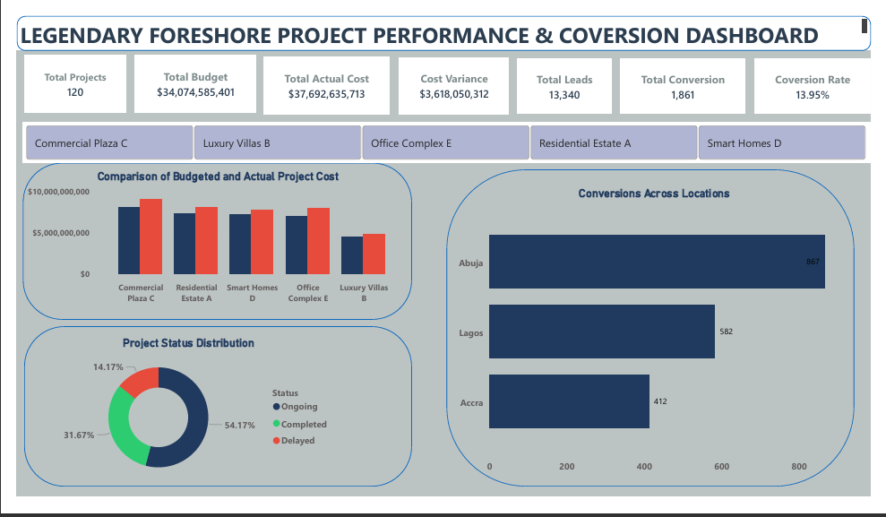

# real-estate-dashboard-analysis
Power BI analysis of real estate project performance, cost efficiency, and conversion insights
# 🏡 Real Estate Project Performance & Conversion Analysis

## 📊 Project Overview

This project analyzes the performance of 120 real estate projects, focusing on cost efficiency, project delays, and lead conversion performance.

The goal is to uncover key business insights and provide data-driven recommendations to improve profitability and operational efficiency.

---

## 📌 Key Metrics

* Total Projects: 120
* Total Budget: $34.07B
* Total Actual Cost: $37.69B
* Cost Variance: $3.62B
* Total Leads: 13,340
* Total Conversions: 1,861
* Conversion Rate: 13.95%

---

## 🔍 Key Insights

### 💰 Cost Performance

* All major projects exceeded their budgets
* Commercial Plaza C recorded the highest cost overrun
* Abuja and Lagos contribute the highest cost inefficiencies

### ⏱️ Project Delays

* Residential Estate A has the highest delay rate (23.4%)
* Abuja shows the highest delay across locations

### 📍 Location Analysis

* Abuja has the highest investment but also higher risk
* Lagos follows closely in total project cost

### 📈 Conversion Performance

* Smart Homes D recorded the highest conversion rate
* Office Complex E recorded the lowest conversion rate

### ⚠️ Sales Efficiency Gap

* Only ~14% of leads converted into customers
* Indicates a large untapped revenue opportunity

---

## 💡 Recommendations

* Implement real-time cost monitoring systems
* Focus investment on high-performing projects
* Improve sales funnel with lead tracking and automation
* Optimize project timelines to reduce delays
* Re-evaluate high-risk locations before further expansion

---

## 🖼️ Dashboard Preview

---

## 📂 Project Files

- Power BI File: [Download Dashboard](Real%20Estate%20Dashboard.pbit)  
- Dataset: [Download Dataset](Real_Estate_Dataset.xlsx)

---

## 🎯 Conclusion

This analysis highlights that while the organization has strong project volume, inefficiencies in cost control, project execution, and conversion strategy are affecting overall profitability.

Addressing these issues will significantly improve business performance and return on investment.
